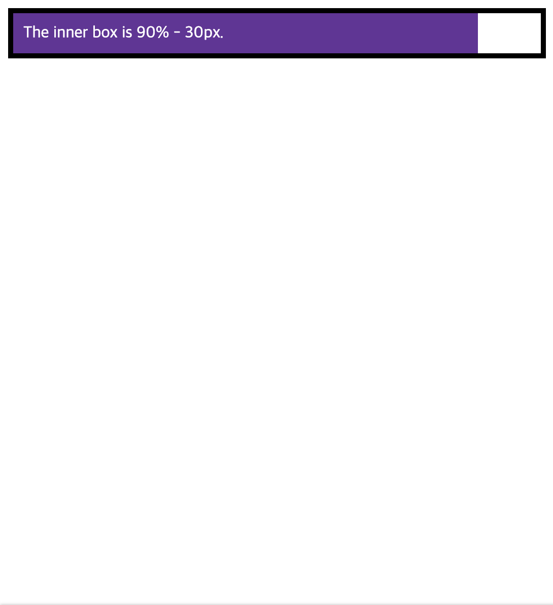
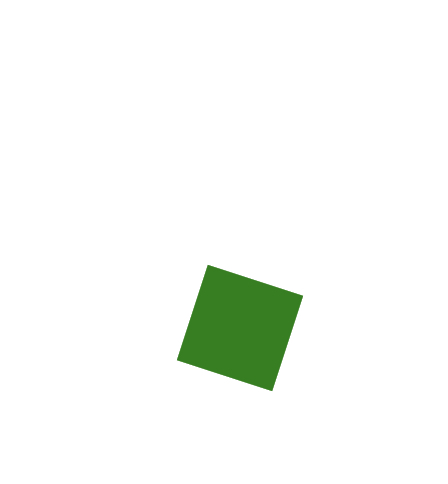

# CSS 구조

---
## 차례
  - [CSS를 HTML에 적용](#css를-html에-적용)
    - [외부 파일을 따로 두고 적용](#외부-파일을-따로-두고-적용)
    - [내부 스타일 적용](#내부-스타일-적용)
    - [인라인 스타일 적용](#인라인-스타일-적용)
  - [선택자](#선택자)
  - [속성 및 값](#속성-및-값)
    - [함수](#함수)
  - [`@`rule](#rule)
  - [Shorthand](#shorthand)
---

## CSS를 HTML에 적용

### 외부 파일을 따로 두고 적용

이 방법이 권장되는 방법이다. 스타일과 관련된 내용을 `.css` 확장자를 가진 파일에 모아두고 여러 페이지에서 불러와서 사용한다.

``` html
<!DOCTYPE html>
<html>
  <head>
    <meta charset="utf-8">
    <title>My CSS experiment</title>
    <link rel="stylesheet" href="styles.css">
  </head>
  <body>
    <h1>Hello World!</h1>
    <p>This is my first CSS example</p>
  </body>
</html>
```

### 내부 스타일 적용

html `head` 쪽에 스타일을 선언하는 방법이다. 최대한 지양해야 하는 방법이다.

``` html
<!DOCTYPE html>
<html>
  <head>
    <meta charset="utf-8">
    <title>My CSS experiment</title>
    <style>
      h1 {
        color: blue;
        background-color: yellow;
        border: 1px solid black;
      }

      p {
        color: red;
      }
    </style>
  </head>
  <body>
    <h1>Hello World!</h1>
    <p>This is my first CSS example</p>
  </body>
</html>
```

### 인라인 스타일 적용

각 태그에 일일이 스타일을 적용하는 것이다. 이도 역시 최대한 지양해야 한다.

``` html
<!DOCTYPE html>
<html>
  <head>
    <meta charset="utf-8">
    <title>My CSS experiment</title>
  </head>
  <body>
    <h1 style="color: blue;background-color: yellow;border: 1px solid black;">Hello World!</h1>
    <p style="color:red;">This is my first CSS example</p>
  </body>
</html>
```

## 선택자

선택자는 스타일을 적용하는 집합에 대한 정의다. 해당 선택자에는 특정 html 태그가 들어갈 수도 있고, `id` 혹은 `class`가 들어갈 수도 있다.

선택자에는 세 종류가 있다.
- element
- class
- id

각각은 다음과 같다.
1. element
   ``` css
   p {
    background-color: red;
   }
   ```
2. class 
   ``` css
   p.title {
    background-color: blue;
   }
   ```
3. id
   ``` css
   p#title {
    background-color: green;
   }
   ```

이러한 선택자들을 적용하여 전체적으로 스타일을 적용할 수 있다.
각 선택자 별로 우선순위는 다음과 같다.

`id > class > element`

만약에 같은 선택자 종류를 가진다면, 뒤에 선언되는 것이 앞에 선언되는 것보다 우선순위가 높다.

즉 다음과 같이 선언되면 후자의 내용(`p`의 배경색은 `blue`다)이 적용된다.

``` css
p {
  background-color: red;
}

p {
  background-color: blue;
}
```

이러한 규칙을 가리켜 '**cascade rule**'이라 칭한다.

## 속성 및 값

css는 기본적으로 속성과 값으로 이루어져 있다.
- 속성: 사용자가 수정가능한 스타일 식별자.
- 값: 속성에 적용될 값(속성마다 적용될 수 있는 값의 범위가 다름).

``` css
h1 {
  color: blue;
  background-color: yellow;
}
```

여기서 `color: blue;`에 해당하는 부분, 즉 속성과 값이 짝을 이루는 부분을 가리켜 CSS declaration라 한다.

그리고 이러한 선언부가 모여 중괄호 안에 있으면 그 안에 있는 것을 가리켜 CSS declaration block이라 일컫는다.

마지막으로, 이 declaration block과 중괄호와 선택자가 합쳐진 것을 CSS ruleset이라 일컫는다.

### 함수

값에는 키워드나 숫자 외에도 함수가 들어갈 수 있다.

- `calc()` 함수
  ``` html
  <div class="outer">
    <div class="box">
      The inner box is 90% - 30px.
    </div>
  </div>
  ```

  ``` css
  .outer {
    border: 5px solid black;
  }

  .box {
    padding: 10px;
    width: calc(90% - 30px);
    background-color: rebeccapurple;
    color: white;
  }
  ```

  이 예제에 대한 결과는 다음과 같다.

  

- transform 함수
  
  ``` html
  <div class="rotate"></div>

  ```

  ``` css
  .rotate {
    position: absolute;
    left: 100px;
    top: 200px;
    width: 50px;
    height: 50px;
    background-color: green;
    transform: rotate(0.8turn);
  }
  ```

  

## `@`rule

CSS의 @rule은 CSS가 무엇을 어떻게 해야 하는지를 제공한다. 이에 대한 간단한 예로서, `@import`가 있다.

``` css
@import 'styles2.css';
```

자주 사용하게 될 @rule 중 하나는 `@media`이다.

``` css
body {
  background-color: pink;
}

@media (min-width: 30em) {
  body {
    background-color: blue;
  }
}
```

위의 예에서는 `body` 태그는 `min-width`가 `30em` 이하일 때에는 배경색이 분홍색이지만, 그 이상일 때에는 배경색이 파란색이 된다.

## Shorthand

몇 개의 속성들은 Shorthand 속성들이라고 불린다. `padding`, `margin`, `border`, `background`, `font` 등이 있다.

하나의 예로서, `padding`은 `paddingLeft`, `paddingTop`, `paddingRight`, `paddingBottom` 으로 나누어서 쓰일 수 있다. 역으로 `padding` 하나에 다 기술될 수도 있다.

``` css
body {
  padding: 10px 15px 5px;
}

body {
  padding-top: 10px;
  padding-right: 15px;
  padding-bottom: 15px;
  padding-left: 5px;
}
```

`background`도 다음과 같이 표현될 수 있다.


``` css
body {
  background: red url(bg-graphic.png) 10px 10px repeat-x fixed;
}

body {
  background-color: red;
  background-image: url(bg-graphic.png);
  background-position: 10px 10px;
  background-repeat: repeat-x;
  background-attachment: fixed;
}
```
