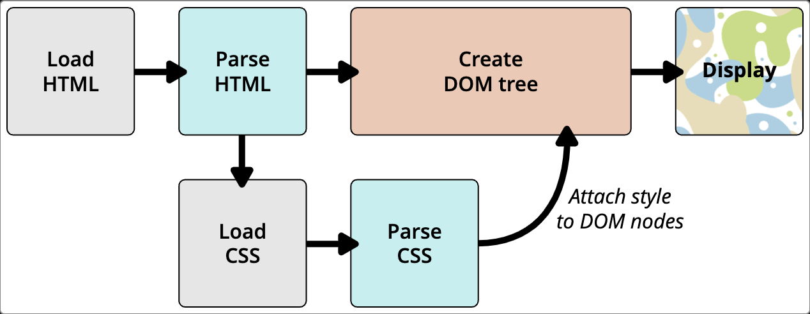

# 5. CSS 동작 방식

이번 챕터에서는 브라우저가 CSS 와 HTML 을 가져와서 웹 페이지로 만드는 방법을 살펴본다.

---
## 차례
  - [CSS 동작 절차](#css-동작-절차)
  - [DOM 정보](#dom-정보)
  - [실제 DOM 표현](#실제-dom-표현)
---

## CSS 동작 절차

모든 브라우저가 똑같지는 않지만 대략적인 절차는 다음과 같다.

1. 브라우저가 HTML(e.g. 네트워크로부터 HTML 로드)을 로드한다.
2. HTML을 DOM(Document Object Model)으로 변환한다. DOM은 컴퓨터 메모리의 문서를 나타낸다.
3. HTML 문서에 연결된 리소스와 CSS 등을 가져온다.
4. 가져온 CSS 구문을 분석하고 선택자 유형별로 다른 규칙들을 bucket으로 정렬한다. 찾은 선택자들(element, class, id)을 기반으로 어느 노드에 어떤 규칙을 적용해야 하는지 결정하고 스타일을 첨부한다(render tree 구성).
5. render tree는 규칙이 적용된 후에 표시되어야 하는 구조로 배치된다.
6. 페이지의 시각적 표현이 화면에 표시된다(painting).

해당 작업을 이미지로 나타내면 다음과 같다.



## DOM 정보

DOM은 트리와 같은 구조를 가지고 있고, CSS는 각각의 DOM 노드에 적용된다. 그리고 개발자 도구에서 디버깅을 수행할 때 해당 DOM 노드를 토대로 디버깅을 하게 된다.

## 실제 DOM 표현

이 과정을 알기 위해서 예제를 살펴보자.

``` html
<p>
  Let's use:
  <span>Cascading</span>
  <span>Style</span>
  <span>Sheets</span>
</p>
```

이를 브라우저가 번역하면 다음과 같이 된다.

```
P
├─ "Let's use:"
├─ SPAN
|  └─ "Cascading"
├─ SPAN
|  └─ "Style"
└─ SPAN
   └─ "Sheets"
```

이를 다 해석하고 나서는 다음과 같은 HTML 페이지가 출력된다.
