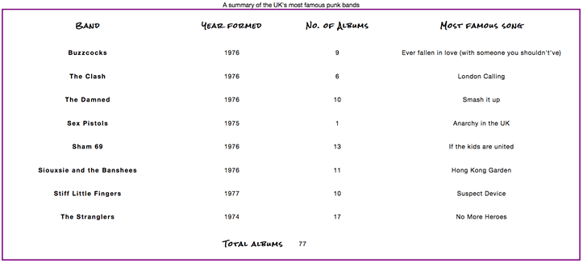

# Styling tables

<br />

## 전형적인 HTML 표

```html
<table>
  <caption>
    A summary of the UK's most famous punk bands
  </caption>
  <thead>
    <tr>
      <th scope="col">Band</th>
      <th scope="col">Year formed</th>
      <th scope="col">No. of Albums</th>
      <th scope="col">Most famous song</th>
    </tr>
  </thead>
  <tbody>
    <tr>
      <th scope="row">Buzzcocks</th>
      <td>1976</td>
      <td>9</td>
      <td>Ever fallen in love (with someone you shouldn't've)</td>
    </tr>
    <tr>
      <th scope="row">The Clash</th>
      <td>1976</td>
      <td>6</td>
      <td>London Calling</td>
    </tr>
    <!-- ... some rows removed for brevity -->
    <tr>
      <th scope="row">The Stranglers</th>
      <td>1974</td>
      <td>17</td>
      <td>No More Heroes</td>
    </tr>
  </tbody>
  <tfoot>
    <tr>
      <th scope="row" colspan="2">Total albums</th>
      <td colspan="2">77</td>
    </tr>
  </tfoot>
</table>
```

`scope`, `caption`, `thead`, `tbody` 등의 기능 덕분에 쉽게 표를 만들 수 있지만, 렌더링된 화면은 아래 이미지처럼 그렇게 보기 좋지는 않습니다.


브라우저에서 기본으로 제공하는 스타일은 읽기도 어렵고, 지루해보입니다. <br />
CSS를 사용하여 이를 개선해 볼 필요가 있을 것 같습니다.

## Styling our table

### 간격 및 레이아웃

```css
/* spacing */

table {
  table-layout: fixed;
  width: 100%;
  border-collapse: collapse;
  border: 3px solid purple;
  /* border-spacing: 30px */
}

thead th:nth-child(1) {
  width: 30%;
}

thead th:nth-child(2) {
  width: 20%;
}

thead th:nth-child(3) {
  width: 15%;
}

thead th:nth-child(4) {
  width: 35%;
}

th,
td {
  padding: 20px;
}
```

- `table-layout: fixed` :

  - 표의 열은 내용의 양에 따라 크기가 정해진다.
  - 값을 fixed로 정하면 table의 크기가 커지지 않는다.
  - 제목의 너비에 따라 열의 크기를 지정한 다음 내용을 적절하게 처리할 수 있다.

<br />

- `border-collapse: collapse` : td, tr에 border를 설정하게 된다면 아래 이미지처럼 border 사이에 기본적으로 2px의 공간이 생기게 된다.
  
  이 공간을 없애주기 위해서는 `table`에 border-collapse: collapse 설정을 해주자.
  
  <br />

- `border-spacing` :

  - 셀과 셀 사이의 간격 조정
  - border-collapse 설정이 있다면 해당 설정은 의미가 없음
    <br />

- `padding`: 표 셀 내부의 간격을 조정하려면 padding으로 값을 설정해준다.

여기까지의 스타일링 결과는 아래와 같다.


<br />

### 텍스트 스타일링

```css
/* typography */

html {
  font-family: "helvetica neue", helvetica, arial, sans-serif;
}

thead th,
tfoot th {
  font-family: "Rock Salt", cursive;
}

th {
  letter-spacing: 2px;
}

td {
  letter-spacing: 1px;
}

tbody td {
  text-align: center;
}

tfoot th {
  text-align: right;
}
```

- `text-align`:
  - css 로 text-align 을 설정해 줄 수 도 있지만 html에서 `align` 값을 통해 설정해 주는 방법도 있다.
  ```html
  <td align="center">text</td>
  ```

여기까지 적용된 화면은 아래와 같다.



<br />

### 그래픽과 컬러

```css
/* graphics and colors */

thead,
tfoot {
  background: url(leopardskin.jpg);
  color: white;
  text-shadow: 1px 1px 1px black;
}

thead th,
tfoot th,
tfoot td {
  background: linear-gradient(
    to bottom,
    rgba(0, 0, 0, 0.1),
    rgba(0, 0, 0, 0.5)
  );
  border: 3px solid purple;
}
```

- header와 footer에 있는 `th`, `td` 에도 그라데이션을 추가해주었다. 이렇게 여러 중첩 요소를 두는 것은 스타일을 레이어 할 수 있기 때문에 좋다.
- `thead`, `tfoot`에 여러 이미지를 사용해서 background image 와 그라데이션 모두 줄 수 있지만, 따로 스타일을 준 것은 여러 background image 또는 그라데이션을 주는 것을 지원하지 않는 구 브라우저에 대응하기 위해 내린 결정이다.

<br />
<br />

### Zebra stripes

표의 다른 데이터 행을 더 쉽게 구문 분석하고 읽을 수 있도록 번갈아 가며 zebra stripes 를 구현해보고자 한다.

```css
/* zebra striping */

tbody tr:nth-child(odd) {
  background-color: #ff33cc;
}

tbody tr:nth-child(even) {
  background-color: #e495e4;
}

tbody tr {
  background-image: url(noise.png);
}

table {
  background-color: #ff33cc;
}
```

- `nth-child(even)` : odd 및 even 키워드를 사용하여 홀수, 짝수를 지정해 스타일링을 해 줄 수 있다.


### caption 스타일링

마지막으로 Caption 태그를 스타일링 해보자

```css
/* caption */

caption {
  font-family: "Rock Salt", cursive;
  padding: 20px;
  font-style: italic;
  caption-side: bottom;
  color: #666;
  text-align: right;
  letter-spacing: 1px;
}
```

- `caption-side`: 캡션의 위치를 설정할 수 있는 property다.

최종 결과물은 아래 이미지와 같다,


<br />
<br />
## 테이블 스타일링 Tip

- 가능하다면 테이블 마크업은 간단하고, 유연하게 유지해라. (percentage를 사용하여 반응형에 가깝게 디자인해라)
- `table-layout: fixed` 를 사용하여 좀 더 예측 가능한 테이블 레이아웃을 만들어, column의 너비가 head와 맞게 세팅되도록 해라
- `border-collapse: collapse` 를 사용해라
- alternative 행을 읽기 쉽게 하려면 줄무늬 형식으로 테이블을 스타일링 해라.
- `thead`, `tbody`,`tfoot` 을 사용하여 표를 논리적 덩어리로 나누어라. 그래야 필요한 경우 스타일을 더 쉽게 레이어할 수 있다.
