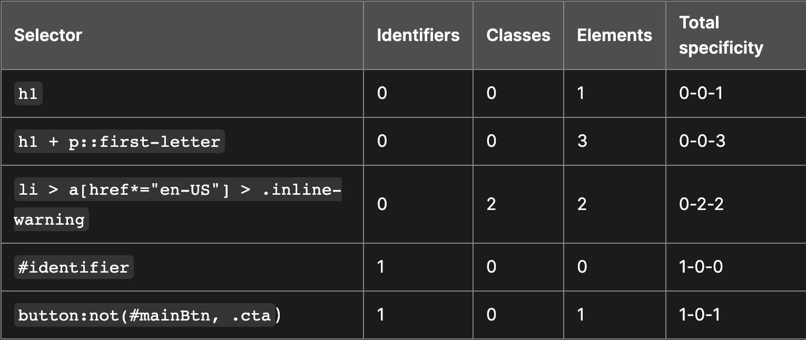

# 계단식(cascade) 및 상속(interitance)

CSS(Cascading Style Sheet)에서 가장 중요한 단어는 Cascading이다.

CSS를 작성하다 보면 어느 순간에 적용되어야 할 스타일이 적용되지 않는 순간이 있다. 이 경우 대부분은 Cascading 되는 CSS의 속성을 잘 이해해지 못했기 때문에 발생한다. 즉 하나의 요소에 대해 여러 가지 스타일이 적용되어 있는 경우다. 계단식의 스타일 적용 특성을 가진 CSS를 이해함에 있어서 중요한 것은 우선순위다. 즉 어떤 스타일이 우선적으로 적용되는지 이해해야 한다.

이와 관련해서 또 중요한 주제는 상속이다. 어떤 스타일은 부모로부터 상속받을 수 있지만 어떤 스타일은 그렇지 않다.

## 계단식(cascade)

동일한 우선순위를 가지는 두 규칙이 적용될 때, 마지막에 나오는 규칙이 적용된다.
``` css
h1 {
  color: red;
}

h1 {
  color: blue
}
```
이 경우에는 `h1` 태그에 `blue` 속성이 적용된다.

계단식에서 고려해야 할 규칙들은 다음과 같다.

1. 소스의 순서
2. 우선순위
3. 중요도

뒤의 규칙들일 수록 더 높다고 보면 된다.

### 소스의 순서

소스의 순서는 뒤로 갈수록 더 크다. 다만 우선순위가 같다는 전제 하에 그렇다.

### 우선순위(specificity)

- id > class > element 선택자 순으로 우선순위가 정해진다.
  ``` css
  .main {
    color: red;
  }

  h1 {
    color: blue;
  }
  ```
  ``` html
  <h1 class="main">test</h1>
  ```
  이때 	`h1`의 색상은 `red`이다.

- 각각 id, class, element 선택자가 있으면 점수가 1점씩 부여되고, 이를 토대로 우선순위가 상세하게 결정된다.
  
- 참고로 인라인 스타일의 경우에는 모든 우선순위보다 높게 평가되어 적용된다.
- `!important`는 인라인 속성을 포함하여 모든 우선순위보다 높게 평가되어 적용된다.
  ``` css
  .better {
  	border: none !important
  }
  ```
- `@layer`를 사용하지 않은 일반 스타일의 경우에는 아무 이름 없는, 그렇지만 마지막에 선언된 layer로 인식된다. 그렇기 때문에 마지막에 적용된 스타일이 우선순위를 갖는 것이다. 마지막에 선언된 layer로 인식되기 때문에 같은 요소에 대해 layer가 선언되어 있다고 했을 때 선언되지 않는 속성이 더 우선순위가 높다. 다만 `!important`의 경우는 빨리 선언된 layer일수록 우선순위가 높다.
  ``` css
  @layer firstLayer, secondLayer;

  p { /* 0-0-1 */
    background-color: red;
    color: grey !important;
   border: 5px inset purple;
  }
  p#addSpecificity { /* 1-0-1 */
    border-style: solid !important;
  }

  @layer firstLayer {
    #addSpecificity { /* 1-0-0 */
      background-color: blue;
      color: white !important;
      border-width: 5px;
      border-style: dashed !important;
    }
  }

  @layer secondLayer {
    p#addSpecificity { /* 1-0-1 */
      background-color: green;
      color: orange !important;
      border-width: 10px;
      border-style: dotted !important;
    }
  }  
  ```
  


## 상속 (inheritance)
- 상속은 어떤 속성은 상속되지만 어떤 속성은 상속되지 않는다.
  예를 들어, `color`, `font-family` 등은 상속되지만 `width`, `height` 등은 상속되지 않는다.
- CSS 내에서는 상속을 제어하기 위한 속성들 5가지를 제공한다.
	- `inherit`: 부모로부터 속성을 상속받는다.
	- `initial`: 해당 속성에 해당하는 초기값으로 설정한다.
	- `unset`: 해당 속성이 상속 가능하면 `interit`로, 불가능하면 `initial`로 설정된다.
	- `revert`: 브라우저에 해당하는 초기값으로 설정한다.
	- `revert-layer`: 이전에 cascade layer(`@layer`)에 설정된 값으로 설정한다.
- 참고로 `all` 키워드를 사용해서 모든 속성 값이 위에 있는 상속에 관한 속성들로 설정될 수 있도록 할 수 있다.

  ``` css
  blockquote {
    background-color: red;
    border: 2px solid green;
  }
          
  .fix-this {
    all: unset;
  }
  ```
