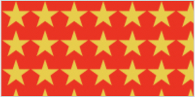
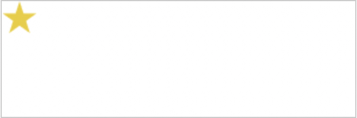
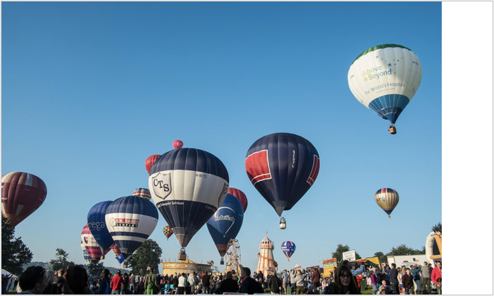
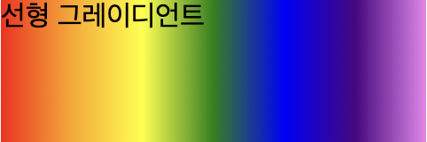
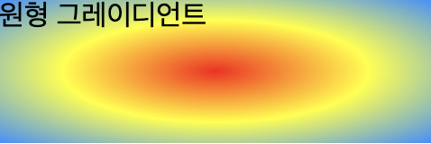
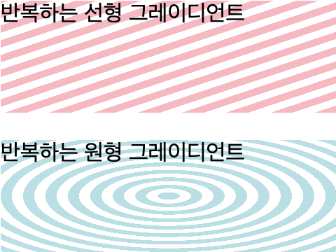
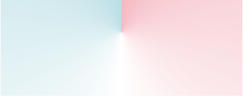
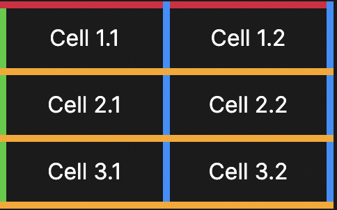
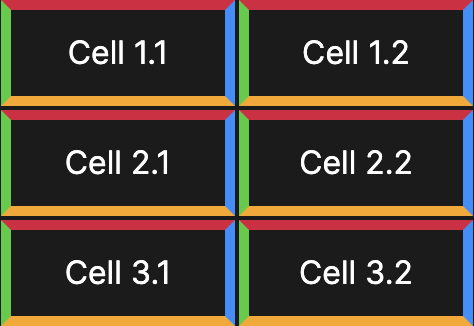

# Backgrounds and borders

## Backgrounds

### `background-color`
배경색을 지정하는 속성.
``` css
.box {
  background-color: #567895;
}
```

### `background-image`
배경 이미지를 지정하는 속성.  
기본적으로 이미지는 배경색 위에 그려진다.
``` css
.b {
  background-color: #f00;
  background-image: url(star.png);
}
```
``` html
<div>
  <div class='b'></div>
</div>
```


### `background-repeat`
이미지의 타일링 동작을 지정하는 속성.  
사용될 수 있는 속성들은 다음과 같다.
- `no-repeat`
  
- `repeat-x`
  
- `repeat-y`
  
- `repeat`
  

### `background-size`
배경 이미지의 크기를 지정하는 속성.
크기를 직접 지정할 수도 있지만 키워드를 사용할 수도 있다.
사용할 수 있는 키워드에는 다음이 있다.
- `cover`: 이미지가 비율을 유지한 채로 박스를 뒤덮도록 한다. 이때 이미지의 가로, 세로 중 최대값이 그려질 요소의 가로, 세로 중 최대값에 맞춰진 상태로 그려진다.
  
- `contain`: 이미지가 배율을 유지한 채로 박스 내에 그려진다. 이때 이미지의 가로, 세로 중 최소값이 그려질 요소의 가로, 세로 중 최소값에 맞춰진 상태로 그려진다.
  

### `background-position`
배경 이미지의 위치를 조정하는 속성.
``` css
.box1 {
  background-image: url(star.png);
  background-repeat: no-repeat;
  background-position: top center;
}

.box2 {
  background-image: url(star.png);
  background-repeat: no-repeat;
  background-position: 20px 10%;
}

.box3 {
  background-image: url(star.png);
  background-repeat: no-repeat;
  background-position: top 20px;
}

.box4 {
  background-image: url(star.png);
  background-repeat: no-repeat;
  background-position: top 20px right 10px;
}
```

### `background-attachment`
내용이 스크롤 될 때 스크롤하는 방법을 지정하는 속성.
- `fixed`: 요소의 배경을 뷰포트에 고정하여 스크롤되지 않도록 함.
- `scroll`: '페이지'가 스크롤될 때 요소의 배경이 스크롤 되도록 함. 중요한 것은 '요소'가 아닌 '페이지'가 스크롤 될 때 스크롤 된다는 것이다.
- `local`: '요소'가 스크롤될 때 요소의 배경이 스크롤 되도록 함. `scroll`이 보통 원하는 기능을 수행하지 않기 때문에 이후에 추가된 속성임.

[***링크 참고***](https://mdn.github.io/learning-area/css/styling-boxes/backgrounds/background-attachment.html)

### Gradient background
그래디언트 배경을 지정하는 속성. `background-image` 속성에 사용될 수 있다. 종류는 다음과 같다.
- 선형
  ``` css
  .linear-gradient {
    background: linear-gradient(to right, red, orange, yellow, green, blue, indigo, violet);
  }
  ```
  
- 원형
  ``` css
  .radial-gradient {
    background: radial-gradient(red, yellow, rgb(30, 144, 255));
  }
  ```
  
- 반복
  ``` css
  .linear-repeat {
    background: repeating-linear-gradient(to top left, lightpink, lightpink 5px, white 5px, white 10px);
  }

  .radial-repeat {
    background: repeating-radial-gradient(powderblue, powderblue 8px, white 8px, white 16px);
  }
  ```
  
- 원뿔형
  ``` css
  .conic-gradient {
    background: conic-gradient(lightpink, white, powderblue);
  }
  ```
  

### Multiple background images
여러 개의 배경 이미지를 지정할 수도 있다.
``` css
background-image: url(image1.png), url(image2.png), url(image3.png), url(image1.png);
background-repeat: no-repeat, repeat-x, repeat;
background-position: 10px 20px, top right;
```

### Shorthand
위의 모든 속성들을 `background` 속성에 한꺼번에 지정해서 사용할 수도 있다.
``` css
.box {
  background: linear-gradient(105deg, rgba(255,255,255,.2) 39%, rgba(51,56,57,1) 96%) center center / 400px 200px no-repeat, url(big-star.png) center no-repeat, rebeccapurple;
}
```

## Borders

### `border-color`
테두리 색상을 지정하는 속성.

### `border-width`
테두리 두께를 지정하는 속성.

### `border-style`
테두리 스타일을 지정하는 속성.
- `none`: 테두리를 그리지 않지만, 칸의 테두리 상쇄(collapsed)시 가장 낮은 우선순위를 가지므로, 주변 칸이 테두리를 가진다면 테두리를 그린다.
- `hidden`: 테두리를 그리지 않지만, 칸의 테두리 상쇄(collapsed)시 가장 높은 우선순위를 가지므로, 주변 칸이 테두리를 가지더라도 테두리를 그리지 않는다.
- `dotted`: 둥근 점 여러 개를 그린다.
- `dashed`: 직사각형 여러 개를 그린다.
- `solid`: 하나의 직선으로 그린다.
- `double`: 두 개의 평행한 직선으로 그린다.
- `groove`: 테두리가 파인 것처럼 그린다. `ridge`의 반대다.
- `ridge`: 테두리가 튀어나온 것처럼 그린다. `groove`의 반대다.
- `inset`: 요소가 파인 것처럼 테두리를 그린다. `border-collapse`가 `collapsed`면 `groove`와 동일하다. `outset`의 반대다.
- `outset`: 요소가 튀어나온 것처럼 테두리를 그린다. `border-collapse`가 `collapsed`면 `ridge`와 동일하다. `inset`의 반대다.
``` css
/* 세로방향 | 가로방향 */
border-style: dotted solid;

/* 위 | 가로방향 | 아래 */
border-style: hidden double dashed;

/* 위 | 오른쪽 | 아래 | 왼쪽 */
border-style: none solid dotted dashed;
```

### `border-radius`
테두리의 모서리를 둥글게 만들어주는 속성.

### `border-collapse`
인접한 요소들의 테두리가 상쇄될 지, 분리될 지를 결정하는 속성. 주로 표에 사용된다.

- `collapse`
  
- `separate`
  

### `border-spacing`
인접한 요소들, 표들의 테두리 간 간격을 지정한다.

### Shorthand
위의 모든 속성들을 `border` 속성에 한꺼번에 지정해서 사용할 수도 있다.
``` css
border: 4mm ridge rgba(211, 220, 50, .6);
```