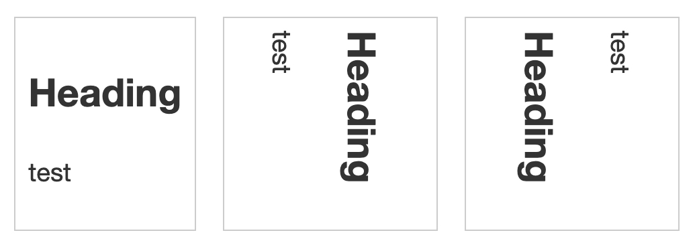

# Handling different text directions

## `writing-mode`
`writing-mode`란 텍스트가 가로로 표시될 것인지, 세로로 표시될 것인지에 대한 여부를 지정하는 속성이다. 다음의 세 가지를 사용할 수 있다.
- `horizontal-tb`: 블록의 표현 방향이 위에서 아래이다. 문장은 수평으로 표현된다.
- `vertical-rl`: 블록의 표현 방향이 우측에서 좌측이다. 문장은 수직으로 표현된다.
- `vertical-lr`: 블록의 표현 방향이 좌측에서 우측이다. 문장은 수직으로 표현된다.

쓰기 모드에 따라서 블록 및 인라인의 방향이 일괄적으로 바뀐다.
``` css
.horizontal {
  writing-mode: horizontal-tb;
}

.vertical-rl {
  writing-mode: vertical-rl;
}

.vertical-lr {
  writing-mode: vertical-lr;
}
```
``` html
<div class="wrapper">
  <div class="box horizontal">
    <h2>Heading</h2>
    <p>test</p>
  </div>
  <div class="box vertical-rl">
    <h2>Heading</h2>
    <p>test</p>
  </div>
  <div class="box vertical-lr">
    <h2>Heading</h2>
    <p>test</p>
  </div>
</div>
```


## 논리적 속성 및 값
일반적으로 `writing-mode`가 디폴트일 때(`horizontal-tb`)에는 물리적 속성 및 값을 써서 요소의 크기, 패딩, 마진 등을 조정했다. 예를 들면, `width`, `height`, `margin-left`, `padding-top` 등이 그것이다.  
그러나 위와 같이 쓰기 모드를 변경하면 물리적 속성을 사용해서 하면 혼란을 야기할 수 있다. 이럴 때에는 논리적 속성을 사용해서 요소의 크기, 패딩, 마진 등을 조정해야 한다.

- 쓰기 모드와 평행한 속성을 조정할 때: `inline`
- 쓰기 모드와 수직인 속성을 조정할 때: `block`
- 크기를 조정할 때: `size`
- left, top을 조정할 때: `start`
- right, bottom을 조정할 때: `end`

조합해보면 다음과 같이 할 수 있다. 참고로 각각은 쓰기 모드에 따라서 다르게 이해되어야 한다. 예를 들어 `horizontal-tb`일 때, `width`는 `width`이지만, `vertical-rl`, `vertical-lr`일 때에는 논리적 속성 `width`(`inline-size`)는 물리적 속성 `height`이다.
- `width`: `inline-size`
- `height`: `block-size`
- `margin-left`: `margin-inline-start`
- `margin-top`: `margin-block-start`
- `margin-right`: `margin-inline-end`
- `margin-bottom`: `margin-block-end`
- `padding-left`: `padding-inline-start`
- `padding-top`: `padding-block-start`
- `padding-right`: `padding-inline-end`
- `padding-bottom`: `padding-block-end`
- `border-left`: `border-inline-start`
- `border-top`: `border-block-start`
- `border-right`: `border-inline-end`
- `border-bottom`: `border-block-end`