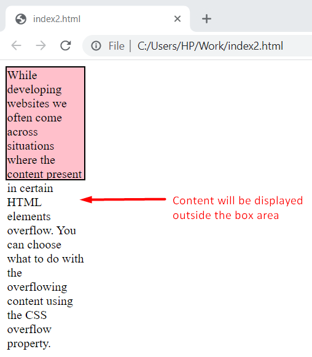
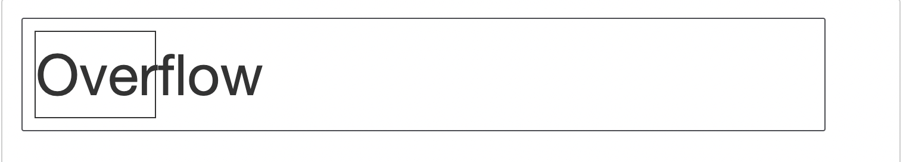
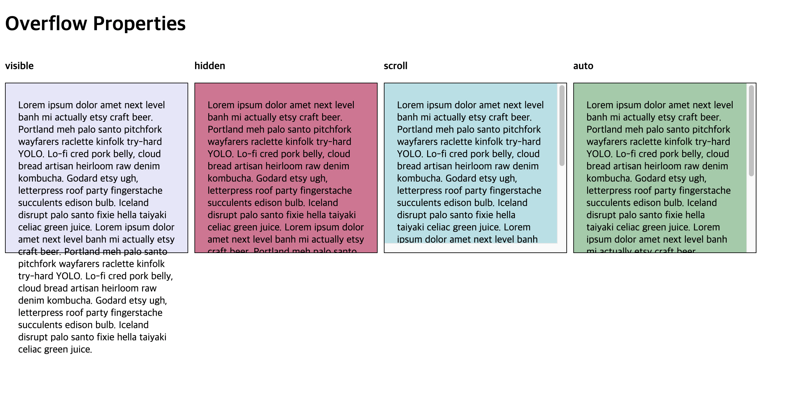

# OverFlowing Content

## overflow 란 무엇인가?

Box는 CSS의 전부다. 레이아웃은 Box로 구성되며 Box의 크기를 제한 할 수 있다. 그러다보면 종종 Box안의 내용이 넘쳐나는 경우가 있다. <br />
이를 우리는 overflow 라고 한다. <br />

Overflow는 박스에 내용이 너무 많을 때 발생하는 현상으로, 박에 모든 컨텐트를 수용할 수 없을 때 발생한다.
CSS 레이아웃을 작성하다보면 overflow 상황이 자주 발생하게 되는데, 이런 상황을 어떻게 대응할지 알아보도록 하자.

## CSS : 데이터 손실을 피하려고 한다.

두 가지 상황에 대해서 css가 우리에게 어떤 화면을 보여주는지 살펴보자.

1. box의 높이를 제한하고, 할당된 영역을 넘어서는 content를 추가해보자.
   
2. box의 너비를 제한하고, box의 너비보다 긴 단어를 적어보자.
   

content가 box를 벗어난 상태 그대로 화면에 보여질 것이다.
1번의 경우 하단에 다른 영역의 Box가 있다하더라도 그 요소 box 영역과 상관없이 겹쳐서 보여질 것이다. <br />
우리는 다음과 같은 의문이 들것이다. <br />
왜 css는 box에 맞춰서 content 사이즈를 조정하지 않을까? <br />
왜 css는 box에 맞춰서 content를 숨기지 않을까? <br />
이는 데이터 손실과 이어지기 때문이다. css가 자체적으로 영역을 벗어난 내용에 대해서 숨기는 처리를 하게 된다면 이는 데이터 손실이며,
데이터 손실의 문제점은 우리가 데이터가 손실되었다는 사실을 알아차리지 못하는데 있다.
<br />
<br />

`width` 와 `height`로 제한하면, CSS 는 사용자가 수행중인 작업을 알고 있으며, overflow 가능성을 염두한채 관리한다고 가정한다.

## overflow 속성

overflow 속성을 통해 동작을 제어해보자.



해당이미지는 아래의 속성으로 만들어진 `box`에 동일한 content를 입력하여 `overflow` 속성으로 제어한 화면이다.

```css
.box {
  width: 250px;
  height: 250px;
  padding: 10px 20px;
  margin: 0 10px 0 0;
  border: 1px solid black;
}
```

| property | Desc                                                                                                                                                    |
| -------- | ------------------------------------------------------------------------------------------------------------------------------------------------------- |
| visible  | default 값으로 overflow 되더라도 컨텐츠를 전부 볼 수 있다.                                                                                              |
| hidden   | 해당 영역을 벗어난 부분은 보여지지 않게 된다.                                                                                                           |
| scroll   | 두 개의 값을 전달하여 x 와 y 스크롤을 지정할 수 있다.<br /> 첫 번째 값은 `scroll-x`, 두번째 값은 `scroll-y`에 적용되며, 하나만 입력하면 둘 다 적용된다. |
| auto     | 브라우저에게 판단을 맡김.                                                                                                                               |

## 결론

- 박스 크기를 고정하면 overflow 문제가 발생할 수 있으므로, 박스 크기 고정에 의존하지 않도록 레이아웃을 리팩터링 하는것이 이상적이다.
- 사이트를 개발할 때는 항상 overflow 문제를 염두에 두어야 한다.
- 작은 박스에서 긴 단어를 처리해야 하는 경우 `word-break` 또는 `overflow-wrap` 값으로 제어한다.
