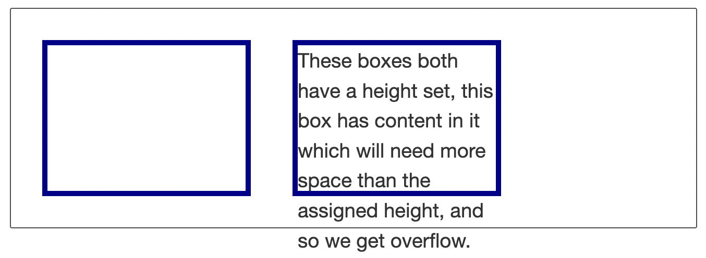
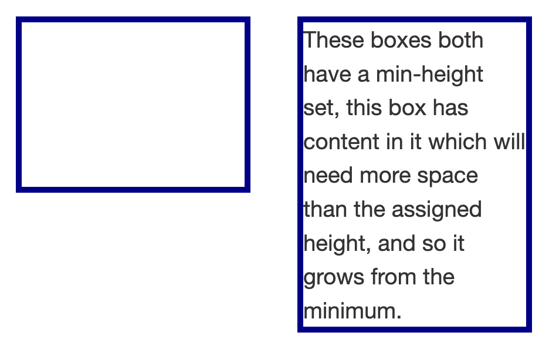

# Sizing items in CSS

## 고유 크기(intrinsic size)
요소에 크기를 따로 설정하지 않으면 고유 크기를 가진다.  
예를 들어 `img`에 크기를 따로 설정하지 않고 이미지를 불러올 경우 `img` 태그는 불러온 이미지의 사이즈를 고유 크기로 가진다.
``` css
img {
  border: 5px solid darkblue;
}
```
``` html

```


아무것도 없는 `div` 태그의 경우에는 높이가 `0`이고, `display` 디폴트 값이 `block`이기 때문에 `width`는 부모의 `width`를 따라간다.
``` css
.box {
  border: 5px solid darkblue;
}
```
``` html
<div class="box"></div>
```


`border`가 `5px`이므로 최종 높이는 `10px`처럼 보이지만 고유 높이는 `0px`이다.

## 특정 크기(extrinsic size) 설정
고유 크기 외에 특정 크기를 지정할 수도 있다.
``` css
.box {
  border: 5px solid darkblue;
  height: 150px;
  width: 200px;
}
```
``` html
<div class="wrapper">
  <div class="box"></div>
  <div class="box">These boxes both have a height set, this box has content in it which will need more space than the assigned height, and so we get overflow.</div>
</div>
```


크기를 지정할 때 백분율을 사용하면 부모 요소 크기에 대하여 %로 크기를 지정할 수 있다.

다만 마진 및 패딩에 백분율을 사용할 때에는 주의해야 하는데, 백분율이 수평 크기에 대한 %로 동작하기 때문이다.

## `min-` 및 `max-` 크기

항상 특정 크기 이상이 되게 하기 위한 속성으로서 `min-` 속성과 항상 특정 크기 이하가 되게 하기 위한 속성으로서 `max-` 속성이 있다.

``` css
.box {
  border: 5px solid darkblue;
  min-height: 150px;
  width: 200px;
}
```
``` html
<div class="wrapper">
  <div class="box"></div>
  <div class="box">These boxes both have a height set, this box has content in it which will need more space than the assigned height, and so we get overflow.</div>
</div>
```


`max-` 속성은 이미지를 반응형으로 만드는 데에 사용되기도 한다.
``` css
.box {
  width: 200px;
}
.minibox {
  width: 50px;
}
.width {
  width: 100%;
}
.max {
  max-width: 100%;
}
```
``` html
<div class="wrapper">
  <div class="box"></div>
  <div class="box"></div>
  <div class="minibox"></div>
</div>
```

첫 번째는 `width: 100%`이므로 컨테이너 크기만큼 이미지가 늘어나서 픽셀이 깨질 수도 있다.  
두 번째는 `max-width: 100%`이므로 컨테이너 크기가 아무리 커도 이미지의 최대 사이즈를 넘어가지 않게 한다.  
세 번째는 `max-width: 100%`이지만 이미지의 최대 크기가 컨테이너 크기보다 작으므로 컨테이너 크기만큼 줄어든다.

## 뷰포트 단위
뷰포트 단위란 뷰포트의 너비의 경우 `vw`, 높이의 경우 `vh`로 지정하는 경우를 말한다. `1vw`는 너비의 1%와 같고, `1vh`는 높이의 1%와 같다. 참고로 뷰포트란 브라우저 상에서 보이는 최상단 윈도우의 클라이언트 영역이다.