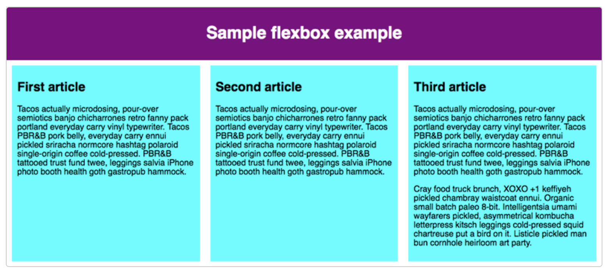

# Flexbox

## 개요

flexbox는 행과 열 형태로 요소들을 배치하는 1차원 레이아웃 메서드다.

flexbox는 다음과 같은 요구사항을 편리하고도 유연하게 적용할 수 있도록 한다.

- 부모 요소 내부에 포함된 블록 콘텐츠를 세로 중심부에 맞추기.
- 사용 가능한 너비와 높이에 관계 없이 하나의 컨테이너에 포함된 모든 자녀 요소가 주어진 너비와 높이를 똑같은 크기로 점유하기.
- 다단 레이아웃에 포함된 모든 단이 서로 다른 크기의 콘텐츠를 포함하고 있더라도 동일한 높이를 갖게 하기.

이를 이해하기 위해서 간단한 예제를 살펴보자

``` html
<!DOCTYPE html>
<html lang="en-us">
  <head>
    <meta charset="utf-8">
    <meta name="viewport" content="width=device-width">
    <title>Flexbox 0 — starting code</title>
    <style>
      html {
        font-family: sans-serif;
      }

      body {
        margin: 0;
      }

      header {
        background: purple;
        height: 100px;
      }

      h1 {
        text-align: center;
        color: white;
        line-height: 100px;
        margin: 0;
      }

      article {
        padding: 10px;
        margin: 10px;
        background: aqua;
      }

      /* Add your flexbox CSS below here */


      
    </style>
  </head>
  <body>
    <header>
      <h1>Sample flexbox example</h1>
    </header>

    <section>
      <article>
        <h2>First article</h2>

        <p>Tacos actually microdosing, pour-over semiotics banjo chicharrones retro fanny pack portland everyday carry vinyl typewriter. Tacos PBR&B pork belly, everyday carry ennui pickled sriracha normcore hashtag polaroid single-origin coffee cold-pressed. PBR&B tattooed trust fund twee, leggings salvia iPhone photo booth health goth gastropub hammock.</p>
      </article>

      <article>
        <h2>Second article</h2>

        <p>Tacos actually microdosing, pour-over semiotics banjo chicharrones retro fanny pack portland everyday carry vinyl typewriter. Tacos PBR&B pork belly, everyday carry ennui pickled sriracha normcore hashtag polaroid single-origin coffee cold-pressed. PBR&B tattooed trust fund twee, leggings salvia iPhone photo booth health goth gastropub hammock.</p>
      </article>

      <article>
        <h2>Third article</h2>

        <p>Tacos actually microdosing, pour-over semiotics banjo chicharrones retro fanny pack portland everyday carry vinyl typewriter. Tacos PBR&B pork belly, everyday carry ennui pickled sriracha normcore hashtag polaroid single-origin coffee cold-pressed. PBR&B tattooed trust fund twee, leggings salvia iPhone photo booth health goth gastropub hammock.</p>

        <p>Cray food truck brunch, XOXO +1 keffiyeh pickled chambray waistcoat ennui. Organic small batch paleo 8-bit. Intelligentsia umami wayfarers pickled, asymmetrical kombucha letterpress kitsch leggings cold-pressed squid chartreuse put a bird on it. Listicle pickled man bun cornhole heirloom art party.</p>
      </article>
    </section>
  </body>
</html>
```


여기서 우리는 `article` 태그를 레이아웃 하기를 원한다고 가정한다. 그러므로 `section` 태그에 스타일을 주어야 한다.

``` css
section {
  display: flex;
}
```

이렇게 하면 다음과 같은 결과가 나온다.


## flex 모델

요소들을 flexbox로 레이아웃할 때 그 상자들은 두 개의 축을 따라 배치된다.

- 기본 축(main axis)  
  flex item이 배치되고 있는 방향으로 진행하는 축이다. 이 기본 축의 시작과 끝을 일컬어 main start, main end라고 한다.
- 교차 축(cross axis)  
  flex item이 내부에 배치되는 방향에 직각을 이루는 축이다. 이 축의 시작과 끝을 일컬어 cross start, cross end라고 한다.
- `display: flex`  
  이것이 설정된 부모 요소를 일컬어 flex container라고 한다.
- flex item  
  flex container 내부에 레이아웃되는 항목을 일컫는다.

## `flex-direction`

flexbox는 기본 축이 진행되는 방향을 지정하는 `flex-direction` 속성을 제공한다. 기본값은 `row`다. 다음의 값들을 설정할 수 있다.
- `row`
- `row-reverse`
- `column`
- `column-reverse`

## `flex-wrap`

레이아웃에 너비, 높이가 고정 크기를 갖고 있어 생길 수 있는 문제는 flexbox 자식 요소가 너비와 높이 바깥으로 나갈 수 있다는 것이다. 이때 `flex-wrap`을 사용하면 된다.

`section`에 `flex-wrap`을 설정하고 `article`에 `flex`를 설정하면 깔끔하게 변경 가능하다.

``` css
article {
  /* ... */
  flex: 200px
  /* ... */
}

section {
  display: flex;
  flex-wrap: wrap;
}
```

> 적용 전
  

> 적용 후
  

## `flex-flow`

`flex-direction`, `flex-wrap`을 한꺼번에 쓰는 속성이다.

``` css
.wrapper {
  flex-direction: row;
  flex-wrap: wrap
}

.wrapper {
  flex-flow: row wrap;
}
```

## `flex`

flex item의 flex 크기 조정을 위한 속성이다.

``` css
article {
  flex: 1;
}
```

이와 같이 설정하면 padding, margin이 설정된 남은 여분의 공간을 모두 동등한 크기로 점유하게 된다. 이렇게 지정하는 방식은 비율로 지정하는 방식이기 때문에 숫자가 커져도 동일한 비율로 적용된다. 다만 특정 아이템의 비율을 조정하고 싶다면 `:nth-of-type(index)`를 사용하면 된다.

``` css
article:nth-of-type(3) {
  flex: 2;
}
```

또 최솟값도 설정할 수 있다.

``` css
article {
  flex: 1 200px;
}

article:nth-of-type(3) {
  flex: 2 200px;
}
```

사실 `flex`는 `flex-grow`, `flex-shrink`, `flex-basis`를 합친 속성이다.

`flex-grow`는 위에서 말한 비율이고, `flex-basis`는 위에서 말한 최솟값이다. `flex-shrink`는 너비를 넘어갈 때에 대한 속성인데, 잘 사용하지 않는다. 이왕이면 `flex`라는 속성으로 제어할 것을 권장한다.

## 정렬

기본 축 혹은 교차 축을 따라서 flex item을 정렬할 수 있다.

flex container에 `align-items`, `justify-content`를 사용해서 각각 수직(교차 축 정렬) 및 수평 정렬(기본 축 정렬)을 지정할 수 있다.

또한 `align-self`를 통해서 각 flex item에 속한 개별 요소들에 대한 `align-items`도 지정할 수 있다.

## `order`

해당 속성으로 flex item들의 순서를 정할 수 있다.

``` css
button:first-child {
  order: 1;
}
```

- 기본적으로 모든 flex item들의 `order`는 `0`이다.
- `order` 값이 높은 flex item들은 낮은 항목들보다 나중에 나타난다.
- `order` 값이 동일한 항목들은 소스 순서대로 나타난다. 4개 항목이 2, 1, 1, 0으로 되어 있다면 제4, 제2, 제3, 제1 순이 된다.

음수를 설정하면 0보다 더 앞에 나타나게 할 수 있다.
