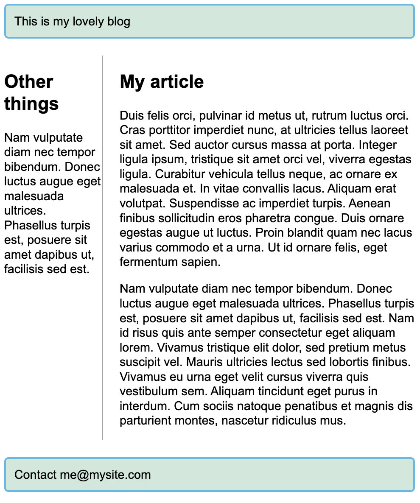

# Grids

먼저 그리드를 위한 예제를 가져오자.

``` css
body {
  width: 90%;
  max-width: 900px;
  margin: 2em auto;
  font: 0.9em/1.2 Arial, Helvetica, sans-serif;
}

.container > div {
  border-radius: 5px;
  padding: 10px;
  background-color: rgb(207, 232, 220);
  border: 2px solid rgb(79, 185, 227);
}

```
``` html
<!DOCTYPE html>
<html lang="en">
  <head>
    <meta charset="UTF-8" />
    <meta name="viewport" content="width=device-width, initial-scale=1.0" />
    <meta http-equiv="X-UA-Compatible" content="ie=edge" />
    <link rel="stylesheet" href="./index.css" />
    <title>Static Template</title>
  </head>
  <body>
    <h1>Simple grid example</h1>

    <div class="container">
      <div>One</div>
      <div>Two</div>
      <div>Three</div>
      <div>Four</div>
      <div>Five</div>
      <div>Six</div>
      <div>Seven</div>
    </div>
  </body>
</html>

```

먼저 그리드를 설정하기 위해서는 grid의 대상이 되는 항목에 다음과 같이 설정한다.

``` css
.container {
  display: grid;
}
```

## `grid-template-columns`
여기에 그리드 열을 설정하기 위해서 다음과 같이 추가한다.

``` css
.container {
  display: grid;
  grid-template-columns: 200px 200px 200px;
}
```

그리드의 길이에는 일반적인 길이와 백분율 외에도 `fr`이라는 단위를 사용할 수 있다. 이는 공간을 균등하게 분배한다.

``` css
.container {
  display: grid;
  grid-template-columns: 1fr 1fr 1fr;
}
```

이렇게 하면 3개의 열이 균등하게 생성된다. 참고로 이는 `repeat` 함수를 사용하여 반복하게 할 수도 있다.

``` css
.container {
  display: grid;
  grid-template-columns: repeat(3, 1fr);
}
```

`2fr`을 설정하게 되면 다른 공간에 비해 2배를 더 차지하게 된다.

## `grid-gap`, `grid-row-gap`, `grid-column-gap`

이를 사용하면 각 그리드 간 간격을 설정할 수 있다.

`grid-gap`는 에지와 파이어폭스의 경우 `grid-` 접두사 없이 사용될 수 있다. 그러나 안전하게 하기 위해서는 두 개 다 설정해주는 것이 좋다.

``` css
.container {
  display: grid;
  grid-template-columns: 1fr 1fr 1fr;
  grid-gap: 20px;
  gap: 20px;
}
```

## 명시적 그리드, 암시적 그리드

명시적 그리드는 `grid-template-columns`, `grid-template-rows`를 통해 설정하는 것을 가리킨다.

<u><b>암시적 그리드가 생성되는 시점은 콘텐츠가 해당 그리드 외부에 배치될 때이다.</b></u>

기본적으로 암시적 그리드 상에 생성된 트랙은 `auto` 크기로 되며, 이는 일반적으로 콘텐츠를 알맞게 들여놓기에 충분히 크다는 것을 의미한다. 만약 암시적 그리드 트랙에 크기를 지정하려면 `grid-auto-columns`, `grid-auto-rows`를 사용하면 된다.

## `minmax()` 함수
이는 최소 최대 크기를 설정하게 해준다. 최솟값을 설정하고, 해당 크기보다 커지면 자동으로 커지게 할 수 있다.

``` css
.container {
  display: grid;
  grid-template-columns: repeat(3, 1fr);
  grid-auto-rows: minmax(100px, auto);
}
```

## 배치

그리드 내에 있는 아이템들을 배치하기 위해서는 다음 속성들을 사용한다.

- `grid-column`
- `grid-row`

각각 다음과 같이 분리해서 사용할 수도 있다.

- `grid-column-start`
- `grid-column-end`
- `grid-row-start`
- `grid-row-end`

``` css
header {
  grid-column: 1 / 3;
  grid-row: 1;
}

article {
  grid-column: 2;
  grid-row: 2;
}

aside {
  grid-column: 1;
  grid-row: 2;
}

footer {
  grid-column: 1 / 3;
  grid-row: 3;
}
```



## `grid-template-areas`

이를 통해서도 항목을 배치할 수 있다.

``` css
.container {
  display: grid;
  grid-template-areas:
      "header header"
      "sidebar content"
      "footer footer";
  grid-template-columns: 1fr 3fr;
  grid-gap: 20px;
}

header {
  grid-area: header;
}

article {
  grid-area: content;
}

aside {
  grid-area: sidebar;
}

footer {
  grid-area: footer;
}

```

이를 사용할 때에 규칙이 있다.

- 그리드로 이뤄진 전체 셀을 채우도록 해야 한다.
- 두 개의 셀을 합치려면 해당 이름을 반복해야 한다.
- 셀을 비우려면 `.`(마침표)를 사용한다.
- 영역은 반드시 직사각형이어야 한다. 예를 들어 L자 모양의 면적을 취할 수는 없다.
- 영역이 다른 위치에서 반복될 수는 없다.