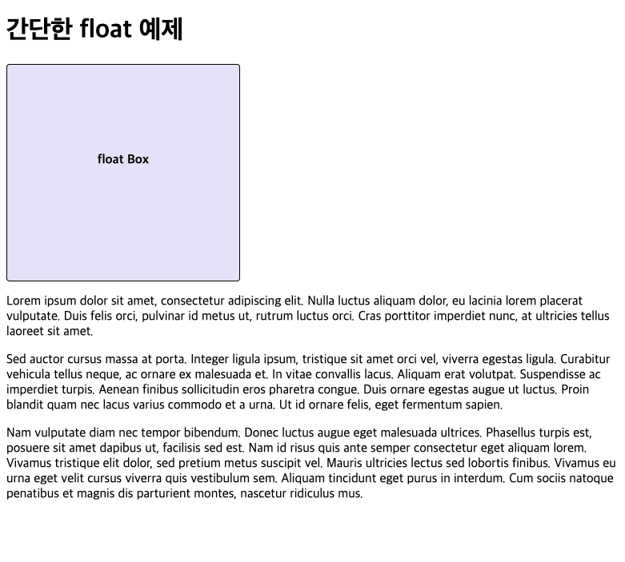
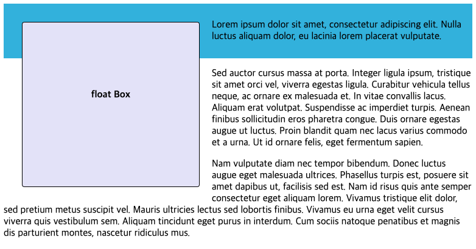

# Floats

`float`는 원래 이미지를 텍스트와 흐름배치하기 위한 속성인데, 웹페이지에서 다수의 컬럼을 배치하기 위한 도구로 흔히 사용하게 되었다. flexbox와 grid가 등장하면서, `float` 속성은 본래 목적대로 돌아가게 되었다. 이번엔 그 부분에 대해서 다뤄보도록 하자.

<br />

## floats의 등장 배경

float 속성은 웹 개발자가 텍스트 열 내부에 float하는 이미지를 포함하고, 텍스트가 이미지를 둘러싸는 간단한 레이아웃을 구현할 수 있도록 하기 위해 도입되었다. 아마 신문에서 이런 레이아웃을 찾아 볼 수 있을 것이다.

그러나, 웹 개발자들이 이미지 뿐만 아니라 무엇이든 float 하게 할 수 있음을 깨닫게 되면서 float의 사용이 확대되었다.

float은 일반적으로 다수의 컬럼들이 나란히 놓이도록하는 웹 사이트의 레이아웃을 만드는데 사용되었는데, 더 새롭고 더 나은 레이아웃 기술 (flexbox, grid) 가 등장하였으므로, float으로 레이아웃을 배치하는 것은 legacy로 간주되어야 한다.

이번에는 float의 적절한 용도에 집중하여 다룰 것이다.

## 간단한 float 예제

아래의 코드에서 `box` 요소에 `float` 속성을 적용 전 후를 비교해 보자.

```html
<h1>간단한 float 예제</h1>

<div class="box">
  <p>float</p>
</div>

<p>
  Lorem ipsum dolor sit amet, consectetur adipiscing elit. Nulla luctus aliquam
  dolor, eu lacinia lorem placerat vulputate. Duis felis orci, pulvinar id metus
  ut, rutrum luctus orci. Cras porttitor imperdiet nunc, at ultricies tellus
  laoreet sit amet.
</p>

<p>
  Sed auctor cursus massa at porta. Integer ligula ipsum, tristique sit amet
  orci vel, viverra egestas ligula. Curabitur vehicula tellus neque, ac ornare
  ex malesuada et. In vitae convallis lacus. Aliquam erat volutpat. Suspendisse
  ac imperdiet turpis. Aenean finibus sollicitudin eros pharetra congue. Duis
  ornare egestas augue ut luctus. Proin blandit quam nec lacus varius commodo et
  a urna. Ut id ornare felis, eget fermentum sapien.
</p>

<p>
  Nam vulputate diam nec tempor bibendum. Donec luctus augue eget malesuada
  ultrices. Phasellus turpis est, posuere sit amet dapibus ut, facilisis sed
  est. Nam id risus quis ante semper consectetur eget aliquam lorem. Vivamus
  tristique elit dolor, sed pretium metus suscipit vel. Mauris ultricies lectus
  sed lobortis finibus. Vivamus eu urna eget velit cursus viverra quis
  vestibulum sem. Aliquam tincidunt eget purus in interdum. Cum sociis natoque
  penatibus et magnis dis parturient montes, nascetur ridiculus mus.
</p>
```

1. `float` 속성 적용 전

```css
.box {
  width: 250px;
  height: 250px;
  padding: 10px 20px;
  margin: 0 10px 0 0;
  border: 1px solid black;
  background-color: lavender;
  border-radius: 4px;
  text-align: center;
}

.box p {
  font-weight: bold;
  margin: 40% 0;
}
```



2. `float` 속성 적용 후

```css
.box {
  float: left;
  width: 250px;
  height: 250px;
  padding: 10px 20px;
  margin: 0 10px 0 0;
  border: 1px solid black;
  background-color: lavender;
  border-radius: 4px;
  text-align: center;
}

.box p {
  font-weight: bold;
  margin: 40% 0;
}
```


float 동작 원리를 살펴보자.

- `float` 설정된 요소는 문서의 일반적인 흐름에서 벗어나 부모 컨테이너의 왼쪽에 고정된다.
  -> float 요소의 너비는 수축하고 일반적인 흐름에서 벗어나게 된다.
  -> 부모 요소는 float된 자식 요소의 높이를 감지하지 못한다.
  -> float 요소 아래에 오는 모든 요소는 그 주변을 감싸게 되며, float 요소가 차지하고 있었던 상단과 오른쪽 공간을 차지하게 된다.

- 텍스트를 밀어내도록 float에 여백을 추가할 수 있지만, float으로부터 텍스트를 이동시키기 위해 텍스트에 여백을 추가할 수는 없다.

  -> `box` 클래스에 적용된 margin속성은 상자와 텍스트 간의 간격을 위해 설정된 값이다. <br />
  -> 해당 부분을 지우고 p 태그에 `margin: 0 0 0 10px` 을 적용하게 된다면 동일한 결과값을 기대 할 수 없다. <br />
  -> _float 요소는 이미 레이아웃에서 이탈된 상태이기 때문_

다음 예제로 해당 부분을 더 자세히 다뤄보자
위의 예제에서 첫번째 단락 p 태그에 `special` 클래스를 부여했다.

```html
<h1>간단한 float 예제</h1>

<div class="box">
  <p>float</p>
</div>

<p class="special">
  Lorem ipsum dolor sit amet, consectetur adipiscing elit. Nulla luctus aliquam
  dolor, eu lacinia lorem placerat vulputate. Duis felis orci, pulvinar id metus
  ut, rutrum luctus orci. Cras porttitor imperdiet nunc, at ultricies tellus
  laoreet sit amet.
</p>

<!-- 생략 -->
```

```css
.special {
  background-color: #5a9ec9;
  padding: 20px;
  color: #fff;
}
```

해당 효과를 더 쉽게 확인하기 위해 기존 box에 margin을 사방으로 적용해 보겠다.

```css
.box {
  /* 위 예제와 동일 */
  margin: 20px;
}
```


float 요소의 너비가 수축되어 텍스트는 float 요소 주위로 배치되고 있지만, float 요소가 일반흐름에서 벗어났기 때문에 단락 주변 Box는 여전히 전체 너비를 유지하고 있다.
-> float 요소 주변 텍스트는 흐르게 만들지만, box 요소들은 float 요소와 겹치게 된다.

## floats 정리하기

float 요소가 일반 흐름에서 벗어나 다른 요소그 그 옆을 차지하는 것을 보았다. 요소에 float 속성을 적용하면, 주변 텍스트 혹은 인라인 요소는 흐르게 만들지만, box 요소들은 float 요소와 겹치게 된다. 이를 막으려면 `clear` 속성을 사용하여 해결 할 수 있다.

이번엔 위의 예제에서 box 아래 두번째에 위치한 p 태그에 `cleared` 클래스를 부여해보자.

```html
<h1>간단한 float 예제</h1>

<div class="box">
  <p>float</p>
</div>

<p class="special">
  Lorem ipsum dolor sit amet, consectetur adipiscing elit. Nulla luctus aliquam
  dolor, eu lacinia lorem placerat vulputate. Duis felis orci, pulvinar id metus
  ut, rutrum luctus orci. Cras porttitor imperdiet nunc, at ultricies tellus
  laoreet sit amet.
</p>

<p class="cleared">
  Sed auctor cursus massa at porta. Integer ligula ipsum, tristique sit amet
  orci vel, viverra egestas ligula. Curabitur vehicula tellus neque, ac ornare
  ex malesuada et. In vitae convallis lacus. Aliquam erat volutpat. Suspendisse
  ac imperdiet turpis. Aenean finibus sollicitudin eros pharetra congue. Duis
  ornare egestas augue ut luctus. Proin blandit quam nec lacus varius commodo et
  a urna. Ut id ornare felis, eget fermentum sapien.
</p>

<!-- 생략 -->
```

```css
.cleared {
  clear: left;
}
```


`cleared` 단락은 float 요소를 clear하며, 더 이상 그 옆에 위치하지 않는다. float을 clear 해주어야 우리가 기대한대로 부모 요소가 자식 요소의 높이를 인지 할 수 있게 된다. `clear` 속성은 다음과 같은 값을 가질 수 있다.

- `left`: 왼쪽에 float한 항목들 clear
- `right`: 오른쪽에 float한 항목들 clear
- `both`: 모든 float 항목 clear

## float 주변을 둘러싼 상자 정리하기

만약에 긴 float 요소와 짧은 단락을 감싸고 있는 box가 있다면 어떻게 동작할까?

```html
<div class="wrapper">
  <div class="box">
    <p>float</p>
  </div>

  <p>
    Lorem ipsum dolor sit amet, consectetur adipiscing elit. Nulla luctus
    aliquam dolor, eu lacinia lorem placerat vulputate.
  </p>
</div>

<p>
  Sed auctor cursus massa at porta. Integer ligula ipsum, tristique sit amet
  orci vel, viverra egestas ligula. Curabitur vehicula tellus neque, ac ornare
  ex malesuada et. In vitae convallis lacus. Aliquam erat volutpat. Suspendisse
  ac imperdiet turpis. Aenean finibus sollicitudin eros pharetra congue. Duis
  ornare egestas augue ut luctus. Proin blandit quam nec lacus varius commodo et
  a urna. Ut id ornare felis, eget fermentum sapien.
</p>

<p>
  Nam vulputate diam nec tempor bibendum. Donec luctus augue eget malesuada
  ultrices. Phasellus turpis est, posuere sit amet dapibus ut, facilisis sed
  est. Nam id risus quis ante semper consectetur eget aliquam lorem. Vivamus
  tristique elit dolor, sed pretium metus suscipit vel. Mauris ultricies lectus
  sed lobortis finibus. Vivamus eu urna eget velit cursus viverra quis
  vestibulum sem. Aliquam tincidunt eget purus in interdum. Cum sociis natoque
  penatibus et magnis dis parturient montes, nascetur ridiculus mus.
</p>
```

```css
.wrapper {
  padding: 10px;
  color: #fff;
  background-color: rgb(79, 185, 227);
}
```



결과는 `.special` 클래스를 부여해줬던 예제와 동일한 모습이다.

다시 한 번 말하지만, 이것은 float요소가 일반적인 흐름에서 벗어났기 때문이다. 후속 요소를 clear 해도 소용 없을 것이다.
이는 만약에 floated 요소와 마찬자기로 짧은 단락이라도 상자로 두 요소를 감싸고 싶을 경우엔 문제가 된다.
이를 처리하려면 세 가지 방법이 있는데, 그 중 두가지 방법은 모든 브라우저에서 동작하지만 핵처럼 사용되고, 세번째 방법은 이런 상황을 정상적으로 처리한다.

### The clearfix hack

- float 요소를 둘러싼 상자 뒤에 일부 생성된 콘텐츠를 넣고, 거기에 `clear:both` 설정하는 방식

```css
.wrapper::after {
  content: "";
  clear: both;
  display: block;
}
```


### overflow

- `.wrapper` 클래스에 overflow 속성을 visible 이외의 값으로 설정
- block formatting context 로 알려진 것을 생성하여 처리
- float 요소는 block formatting context 에 포함되어 배경은 두 개 항목 뒤에 위치함
- overflow 사용에 따라 원치 않는 스크롤 막대나 잘린 그림자가 발견될 수 있다.

```css
.wrapper {
  padding: 10px;
  overflow: auto;
  background-color: rgb(79, 185, 227);
}
```

### display: flow-root

- 이 문제를 해결하는 정석
- block formatting contex 생성하기 위해서만 존재
- 의도하지 않은 결과는 없음

```css
.wrapper {
  display: flow-root;
  padding: 10px;
  background-color: rgb(79, 185, 227);
}
```
