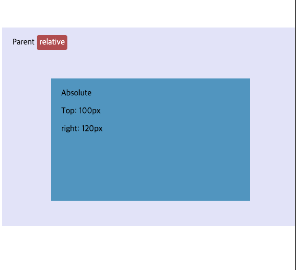
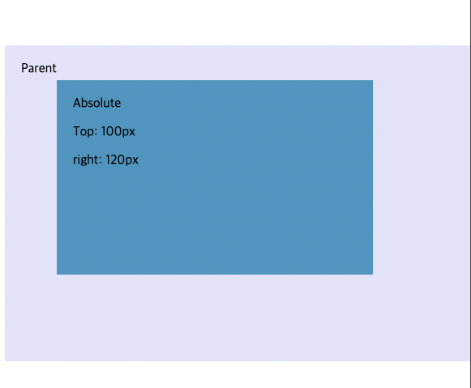
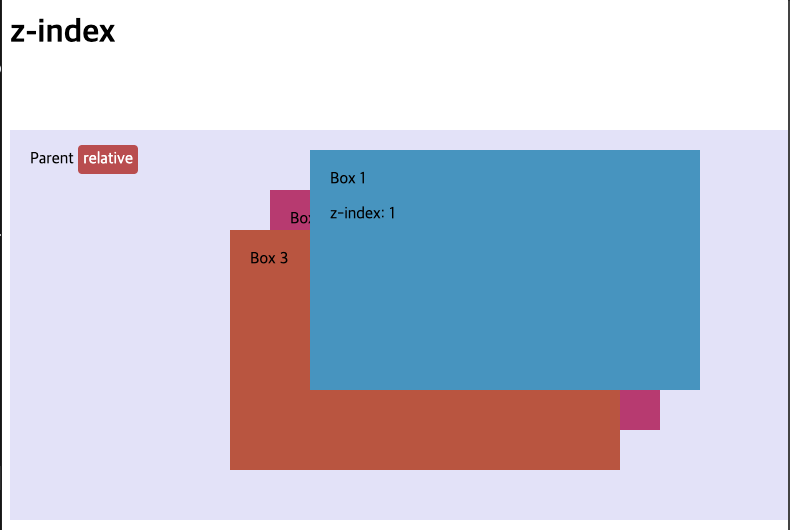

# Positioning

일반적인 문서 흐름에서 요소를 꺼내어 가장 위에 위치하게 한다거나 vierport 안에서 항상 같은 위치에 남아있도록 하는 등 다르게 동작하게 만들 수 있다.

이번엔 서로 다른 position 값과 사용법에 대해서 알아보자.

## 소개

포지셔닝은 기본 문서 흐름에 따른 동작을 무시하고 흥미로운 효과를 낼 수 있도록 하는 것이다.
포지셔닝은 다음과 같은 경우에 사용된다.

- 레이아웃 내부의 일부 box 위치를 약간 변경한다거나 살짝 다른 느낌을 주고 싶은 경우
- 페이지의 다른 부분의 상위에 떠있는 UI를 만들고 싶은 경우
- 스크롤과 상관없이 브라우저 내부의 동일한 위치에 놓이게 하고 싶은 경우

HTML요소에 특정 유형의 포지셔닝을 활성화하기 위해 `position` 속성을 사용한다.

## 정적 위치

`position: static;`

- 모든 요소의 기본값
- 문서 레이아웃 대열상에 일반 위치에 배치

## 상대 위치

`position: relative;`

- 일단 일반적인 흐름대로 정상적으로 위치했다가 다른 요소와 중첩되는 것을 포함하여 최종 위치 수s정 가능
- top, bottom, left, right 사용

## 절대 위치

`position: absolute;`

- 간격은 더 이상 존재하지 않게됨
- 일반 문서 레이아웃 흐름에 존재하지 않게 됨 (독자적인 레이어상에 위치)
- margin 축소 영향 없음
- relative 한 부모를 기준으로 top, bottom, left, right 로 동작

아래 예시로 더 자세히 살펴보자

```html
<body>
  <div class="container">
    Parent
    <span class="relative">relative</span>
    <div class="absolute-box">
      Absolute
      <p>Top: 100px</p>
      <p>right: 120px</p>
    </div>
  </div>
</body>
```

```css
.container {
  position: relative;
  width: 100%;
  height: 350px;
  padding: 20px;
  margin: 10% 0;
  background-color: lavender;
}

.absolute-box {
  position: absolute;
  top: 100px;
  right: 120px;
  width: 350px;
  height: 200px;
  padding: 20px;
  background-color: #5a9ec9;
}
```

- absolute-box의 부모인 container가 relative 이므로 absolute-box는 container를 기준으로 포지션을 잡는다



- 이번엔 container의 position 속성을 지우면?
  -> 절대적 위치잡기 요소는 initial containing block에 포함되게 된다.
  -> 뷰포트 크기를 갖게 됨
  -> 초기 뷰포트 기준과 비례한 곳에 위치하게 됨
  -> body를 기준으로 비례하여 절대적 위치를 잡음



position-box는 동일한 top과 left 값으로 포지셔닝을 하지만, relative가 누구냐에 따라 위치가 다르게 된다.

## z-index

요소가 겹치면, 레이어 되는 순서는 어떻게 결정될까?

```html
<div class="container">
  Parent
  <!-- <span class="relative">relative</span> -->
  <div class="absolute first">
    Box 1
    <p>z-index</p>
  </div>
  <div class="second">Box 2</div>
  <div class="third">Box 3</div>
</div>
```

```css
.first {
  top: 20px;
  right: 120px;
  background-color: #5a9ec9;
}

.second {
  top: 60px;
  right: 160px;
  background-color: #b8437d;
}

.third {
  top: 100px;
  right: 200px;
  background-color: #bb6045;
}
```

- 위 상황에서 레이아웃은 Box3 > Box2 > Box1 순으로 Box1이 제일 밑에 쌓이게 될 것이다.
  

- `z-index` 속성으로 스택 순서를 바꿀 수 있다.
- `z-index` 는 z축을 가리킨다.
- z축이란 스크린 표면으로부터 진행하는 가상 라인으로, 사용자 얼굴 쪽으로 향하는 라인이다.
- 양수 값은 스택 상단으로 이동하며, 음수는 스택 하단으로 이동한다.
- default 값은 `auto`로 사실상 0 이다.

- z-index 속성으로 Box1을 스택 가장 위로 이동하게 해보자
  -> first 클래스에 z-index를 추가하면 된다.

```css
.first {
  z-index: 1;
}
```



## 고정 위치

` position: fixed`

- 절대 위치와 동일하게 동작
- 절대위치는 가까운 부모 요소 기준으로 요소를 고정시키지만, 고정위치는 브라우저 뷰포트 기준으로 요소를 고정한다.
- 제자리에 고장된 UI에 적합하다.
- 스크롤시 제목 밑으로 콘텐츠가 사라지는 것처럼 보인다.
  <br />

  [fixed-example](https://mdn.github.io/learning-area/css/css-layout/positioning/6_fixed-positioning.html)

## sticky

` position: sticky`

- 상대 위치와 절대 위치가 합쳐진 하이브리드다.
- 요소가 특정 위치에 스크롤 될때까지 상대 위치잡기처럼 행동하다가 그 뒤에 위치가 고정된다.

<br />

[sticky-example](https://mdn.github.io/learning-area/css/css-layout/positioning/7_sticky-positioning.html)
