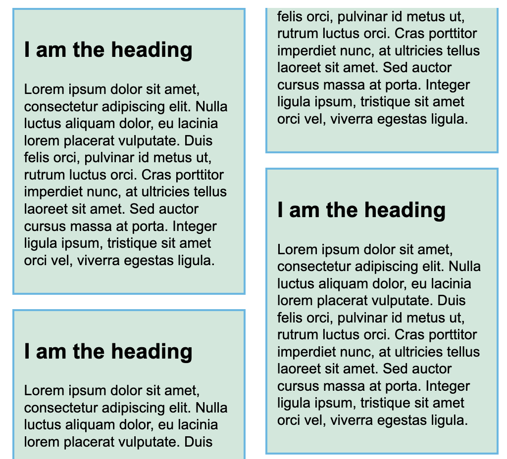

# Multiple column layout

이는 흔히 신문에서 볼 수 있는 레이아웃으로서, 다단 레이아웃이라 일컫는다. 이에 대한 내용을 살펴보기 위해서 다음 예제를 참고한다.

``` html
<!DOCTYPE html>
<html lang="en-us">
  <head>
    <meta charset="utf-8">
    <meta name="viewport" content="width=device-width">
    <title>Multicol starting point</title>
    <style>
      body {
        width: 90%;
        max-width: 900px;
        margin: 2em auto;
        font: .9em/1.2 Arial, Helvetica, sans-serif;
      }
    </style>
  </head>

<body>
  <div class="container">
    <h1>Simple multicol example</h1>

    <p>
      Lorem ipsum dolor sit amet, consectetur adipiscing elit. Nulla luctus aliquam dolor, eu lacinia lorem placerat vulputate.
      Duis felis orci, pulvinar id metus ut, rutrum luctus orci. Cras porttitor imperdiet nunc, at ultricies tellus
      laoreet sit amet. Sed auctor cursus massa at porta. Integer ligula ipsum, tristique sit amet orci vel, viverra
      egestas ligula. Curabitur vehicula tellus neque, ac ornare ex malesuada et. In vitae convallis lacus. Aliquam
      erat volutpat. Suspendisse ac imperdiet turpis. Aenean finibus sollicitudin eros pharetra congue. Duis ornare
      egestas augue ut luctus. Proin blandit quam nec lacus varius commodo et a urna. Ut id ornare felis, eget fermentum
      sapien.
    </p>

    <p>
      Nam vulputate diam nec tempor bibendum. Donec luctus augue eget malesuada ultrices. Phasellus turpis est, posuere
      sit amet dapibus ut, facilisis sed est. Nam id risus quis ante semper consectetur eget aliquam lorem. Vivamus
      tristique elit dolor, sed pretium metus suscipit vel. Mauris ultricies lectus sed lobortis finibus. Vivamus eu
      urna eget velit cursus viverra quis vestibulum sem. Aliquam tincidunt eget purus in interdum. Cum sociis natoque
      penatibus et magnis dis parturient montes, nascetur ridiculus mus.
    </p>
  </div>
</body>
</html>
```

## 다단 설정

여기서 `container` 클래스에 `column-count` 혹은 `column-width`를 추가하여 다단 레이아웃으로 전환할 수 있다.

`column-count`를 사용하면 개수에 따라서 자동으로 단을 분배하고, `column-width`를 사용하면 단을 설정된 값만큼 분배하되 남은 공간에 맞게 분배한다.

## 다단 스타일링

- `column-gap`: 다단 사이 간격을 추가하는 속성.
- `column-rule`: 다단 사이 규칙을 추가하는 속성.

참고로 다단에 설정된 개별 단들은 개별적으로 설정될 수 없다.

`column-rule`은 `column-rule-color`, `column-rule-style`, `column-rule-width`를 합친 속성이다.

``` css
.container {
  column-count: 3;
  column-gap: 20px;
  column-rule: 4px dotted rgb(79, 185, 227);
}
```

참고로 `column-rule`을 통해서 만들어진 규칙은 폭을 점유하지 않는다.

## 모든 열에 걸쳐 있도록 만들기

특정 요소가 모든 열에 걸쳐 있도록 만들기 위해서 `column-span: all`을 사용할 수 있다.


## Columns and fragmentation

다단 레이아웃을 그냥 설정하게 되면 사용자 경험을 저해할 수 있는데, 그 이유는 단을 일반적으로 설정하게 되면 다음과 같이 단을 나누는 한도 내에서 단을 쪼개기 때문이다. 예제를 보자.

``` css
.container {
  column-width: 250px;
  column-gap: 20px;
}

.card {
  background-color: rgb(207, 232, 220);
  border: 2px solid rgb(79, 185, 227);
  padding: 10px;
  margin: 0 0 1em 0;
}

```



이 예제는 `card`가 세 개 있는 경우다.

이와 같이 쪼개지게 되면 사용자의 독서 경험을 저해할 수 있다.

이를 개선하기 위해서 `break-inside: avoid`를 사용할 수 있다.

``` css
.card {
  break-inside: avoid;
  background-color: rgb(207, 232, 220);
  border: 2px solid rgb(79, 185, 227);
  padding: 10px;
  margin: 0 0 1em 0;
}
```

