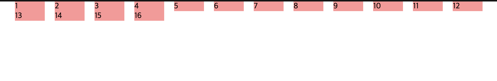
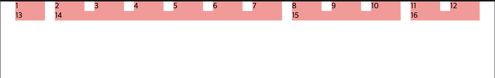
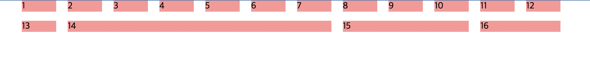

# 레거시 메서드 레이아웃

그리드 시스템은 CSS 레이아웃에서 사용되는 매우 일반적인 기능이며, CSS 그리드 레이아웃 이전에는 floats 또는 기타 레이아웃 기능을 이용하여 그리드 레이아웃을 구현하곤 했다. 이번엔 우리는 그리드 시스템이 등장하기 이전에 어떻게 그리드 레이아웃을 구현했는지 살펴보며 비교해보자.

## CSS 그리드 레이아웃 이전의 레이아웃과 그리드 시스템

CSS가 최근까지 내장된 그리드 시스템을 가지고 있지 않은채, 그리드와 같은 디자인 생성을 위해 다른 방법들을 대체로 사용했다.
이러한 방식은 이제 우리는 'legacy'라고 부를것이다.

새로운 프로젝트의 경우 레이아웃 틀을 형성하기위해 대부분 하나 이상의 현대 레이아웃 메서드를 합쳐서 사용하는 CSS 그리드 레이아웃을 사용할 것이다.
하지만 이런 메서드를 지원하지 않는 브라우저를 위해 레거시 메서드를 이용해서 레이아웃을 작성한 경우를 종종 마주하게 될 것이다.
이런 코드를 유지보수하고, 새로운 메서드를 지원하지 않는 브라우라우저를 위한 대체 코드를 작성하기 위해 우리는 레거시 메서드가 어떻게 동작하고, CSS 그리드 레이아웃과 무엇이 다른지 이해할 필요가 있다.

이번엔 floats와 flexbox 동작 방식을 기반으로 한 그리드 시스템과 그리드 프레임워크가 어떻게 동작하는지 알아보자.

## 2열 레이아웃

가능한 가장 간단한 예시인 두 개의 열 레이아웃으로 시작해보자.

```html
<h1>2열 레이아웃 예제</h1>
<section>
  <h2>첫 번째 열</h2>
  <p>
    Lorem ipsum dolor sit amet, consectetur adipiscing elit. Nulla luctus
    aliquam dolor, eu lacinia lorem placerat vulputate. Duis felis orci,
    pulvinar id metus ut, rutrum luctus orci. Cras porttitor imperdiet nunc, at
    ultricies tellus laoreet sit amet. Sed auctor cursus massa at porta. Integer
    ligula ipsum, tristique sit amet orci vel, viverra egestas ligula. Curabitur
    vehicula tellus neque, ac ornare ex malesuada et. In vitae convallis lacus.
    Aliquam erat volutpat. Suspendisse ac imperdiet turpis. Aenean finibus
    sollicitudin eros pharetra congue. Duis ornare egestas augue ut luctus.
    Proin blandit quam nec lacus varius commodo et a urna. Ut id ornare felis,
    eget fermentum sapien.
  </p>
</section>

<section>
  <h2>두 번째 열</h2>
  <p>
    Nam vulputate diam nec tempor bibendum. Donec luctus augue eget malesuada
    ultrices. Phasellus turpis est, posuere sit amet dapibus ut, facilisis sed
    est. Nam id risus quis ante semper consectetur eget aliquam lorem. Vivamus
    tristique elit dolor, sed pretium metus suscipit vel. Mauris ultricies
    lectus sed lobortis finibus. Vivamus eu urna eget velit cursus viverra quis
    vestibulum sem. Aliquam tincidunt eget purus in interdum. Cum sociis natoque
    penatibus et magnis dis parturient montes, nascetur ridiculus mus.
  </p>
</section>
```

```css
body {
  width: 90%;
  max-width: 900px;
  margin: 0 auto;
}
```

위와같은 코드에서 두 section이 나란히 놓이길 원한다면, float을 사용해 각각 너비의 합이 90%가 되게 만들어주면 된다.

```css
section:nth-of-type(1) {
  float: left;
  width: 48%;
}

section:nth-of-type(2) {
  float: right;
  width: 48%;
}
```


## 간단한 레거시 그리드 프레임워크 생성하기

- 레거시 프레임 워크의 대부분은 그리드처럼 보이는 것을 만들기 위해 float 속성을 활용한다.
- 총 너비, 우리가 원하는 열의 수, 배수로의 너비 및 열의 너비를 계산하여 고정너비를 사용한다.

### 고정 너비 그리드 예시

```html
<div class="wrapper">
  <div class="row">
    <div class="col">1</div>
    <div class="col">2</div>
    <div class="col">3</div>
    <div class="col">4</div>
    <div class="col">5</div>
    <div class="col">6</div>
    <div class="col">7</div>
    <div class="col">8</div>
    <div class="col">9</div>
    <div class="col">10</div>
    <div class="col">11</div>
    <div class="col">12</div>
  </div>
  <div class="row">
    <div class="col span1">13</div>
    <div class="col span6">14</div>
    <div class="col span3">15</div>
    <div class="col span2">16</div>
  </div>
</div>
```

위의 레이아웃을 우리는 12 x 2 그리드를 만들것이다.

```css
* {
  box-sizing: border-box;
}

body {
  width: 980px;
  margin: 0 auto;
}

.wrapper {
  padding-right: 20px;
}

/* 행은 계속 분리된 채로 있으며, 서로 간섭하지 않게 하기 위함 */
.row {
  clear: both;
}

.col {
  float: left;
  margin-left: 20px;
  width: 60px;
  background: rgb(255, 150, 150);
}
```



- 두 개 이상의 열을 하나로 합치길 원한다면, 해당 컨테이너에 width 값을 필요한 열 갯수에 맞춰 조정하기 위해 클래스를 부여해 조절해보자.

```css
/* Two column widths (120px) plus one gutter width (20px) */
.col.span2 {
  width: 140px;
}
/* Three column widths (180px) plus two gutter widths (40px) */
.col.span3 {
  width: 220px;
}
/* And so on... */
.col.span4 {
  width: 300px;
}
.col.span5 {
  width: 380px;
}
.col.span6 {
  width: 460px;
}
.col.span7 {
  width: 540px;
}
.col.span8 {
  width: 620px;
}
.col.span9 {
  width: 700px;
}
.col.span10 {
  width: 780px;
}
.col.span11 {
  width: 860px;
}
.col.span12 {
  width: 940px;
}
```



### 유동적인 그리드 생성하기

우리는 브라우저 viewport에 맞춰 너비가 유동적으로 변하길 원한다면, 픽셀 너비를 백분율로 바꿔 구현할 수 있다.

`target / context = result`

<br />

- 열 너비의 경우 목표 너비는 60px이고 콘텐츠는 래퍼 클래스의 총합 960px 이다.

- `.col`의 너비 = `60 / 960 = 0.0625 -> 6.25%`

- `.wrapper`의 padding-right = `20 / 960 = 0.02083333333 -> 2.08333333%`

```css
.wrapper {
  padding-right: 2.08333333%;
}

.col {
  float: left;
  margin-left: 2.08333333%;
  width: 6.25%;
  background: rgb(255, 150, 150);
}

/* Two column widths (12.5%) plus one gutter width (2.08333333%) */
.col.span2 {
  width: 14.58333333%;
}
/* Three column widths (18.75%) plus two gutter widths (4.1666666) */
.col.span3 {
  width: 22.91666666%;
}
/* And so on... */
.col.span4 {
  width: 31.24999999%;
}
.col.span5 {
  width: 39.58333332%;
}
.col.span6 {
  width: 47.91666665%;
}
.col.span7 {
  width: 56.24999998%;
}
.col.span8 {
  width: 64.58333331%;
}
.col.span9 {
  width: 72.91666664%;
}
.col.span10 {
  width: 81.24999997%;
}
.col.span11 {
  width: 89.5833333%;
}
.col.span12 {
  width: 97.91666663%;
}
```

### calc() 함수를 사용한 편리한 계산법

```css
.col.span2 {
  width: calc((6.25% * 2) + 2.08333333%);
}
.col.span3 {
  width: calc((6.25% * 3) + (2.08333333% * 2));
}
.col.span4 {
  width: calc((6.25% * 4) + (2.08333333% * 3));
}
.col.span5 {
  width: calc((6.25% * 5) + (2.08333333% * 4));
}
.col.span6 {
  width: calc((6.25% * 6) + (2.08333333% * 5));
}
.col.span7 {
  width: calc((6.25% * 7) + (2.08333333% * 6));
}
.col.span8 {
  width: calc((6.25% * 8) + (2.08333333% * 7));
}
.col.span9 {
  width: calc((6.25% * 9) + (2.08333333% * 8));
}
.col.span10 {
  width: calc((6.25% * 10) + (2.08333333% * 9));
}
.col.span11 {
  width: calc((6.25% * 11) + (2.08333333% * 10));
}
.col.span12 {
  width: calc((6.25% * 12) + (2.08333333% * 11));
}
```

### Semantic vs "unsemantic" 그리드 시스템

- 레이아웃을 정의하기위해 클래스를 부여하게 된다면, 클래스명을 semantic하게 작성해라.
- unsemantic의 예시로 여기서 사용된 span2, span3, 기타 등등과 같은 클래스의 경우다.
- span2, span3 보다도 semantic하게 content로 명시해보자

### 그리드 내부에 컨테이너 오프셋 적용

- 컨테이너 사이에 빈 공간을 남기고 싶다면 왼쪽 여백을 추가하여 그리드를 시각적으로 밀어 넣을 수 있는 오프셋 클래스를 생성해야 한다.

```css
.offset-by-one {
  margin: 0 0 0 10.41666666%;
}
```

- 왼쪽 여백이 필요한 column 에 `.offset-by-one` 클래스를 각각 부여해준다.

```html
<div class="col span5 offset-by-one">14</div>
```

- 간격띄우기를 위한 공간을 만들기 위해, 합쳐질 열의 갯수를 줄여야 한다.

### floats 격자의 한계점

- 총 너비가 정확하게 합산되는지, 행이 수용할 수 있는 것보다 더 많은 열을 하나로 합치려는 요소 무리를 행에 포함하지 않도록 주의해야 한다.
  -> 그리드 열의 갯수가 해당 그리드 비해 너비를 많이 차지하게 된다면, 끝 부분에 있는 요소 무리가 다음 행으로 떨어지면서 레이아웃이 틀어지게 된다.
- 이 시스템의 가장 큰 한계는 본질적으로 1차원이라는 점이다.
  - 요소의 높이를 명시적으로 설정하지 않고서는 요소의 높이를 제어하기가 매우 어렵다.
  - 콘텐츠의 높이가 예상될 경우에만 유효하다.

## flexbox 그리드

위의 예시를 이번엔 flexbox를 사용해 그리드 레이아웃을 만들어보자.

```css
body {
  width: 90%;
  max-width: 980px;
  margin: 0 auto;
}

.wrapper {
  padding-right: 2.08333333%;
}

.row {
  display: flex;
}

.col {
  width: 6.25%;
  margin: 0 0 1em 2.08333333%;
  flex: 1 1 auto;
  background: rgb(255, 150, 150);
}
```



- `.col` 클래스상에 flex 속성의 첫 번째 값인 `flex-grow`를 1로 설정
  -> 항목 무리가 확장할 수 있도록 함
- 두 번째 속성값인 `flex-shrink`를 1로 설정
  -> 하여 항목 무리가 축소할 수 있게 함
- 세 번째 값인 `flex-basis`를 auto로 설정
  -> 요소는 width가 설정되어 있고, auto 값을 통해 해당 너비값을 `flex-basis` 값으로 사용하게 됩니다.
- 이를 수정하려면 해당 요소에 대해 flex-basis가 사용하는 값을 대체할 너비를 제공하기 위해 span에 클래스를 부여한다.

## 제 3자 그리드 시스템

- 웹에서 "CSS 그리드 프레임워크"를 검색하면 다양한 프레임워크를 찾아볼 수 있다.
- Bootstrap와 Foundation같은 인기 프레임워크에는 그리드 시스템이 포함되어 있다.
- CSS 혹은 전처리기를 사용하여 개발된 독립형 그리드 시스템도 있다.
  - [skeleton](http://getskeleton.com/) 에 방문하여 zip 파일을 다운로드 받아 사용한다.

이번엔 Skeleton을 통해 그리드 시스템을 간단하게 살펴보겠다. <br />
(해당 예제 코드가 길어 css 파일과 html파일을 첨부하였다. index.html 파일을 실행시켜 결과를 확인할 수 있다.)
